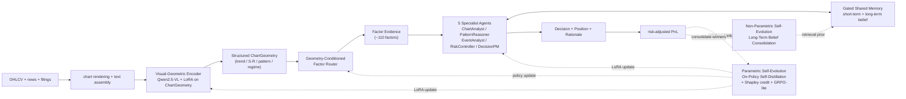
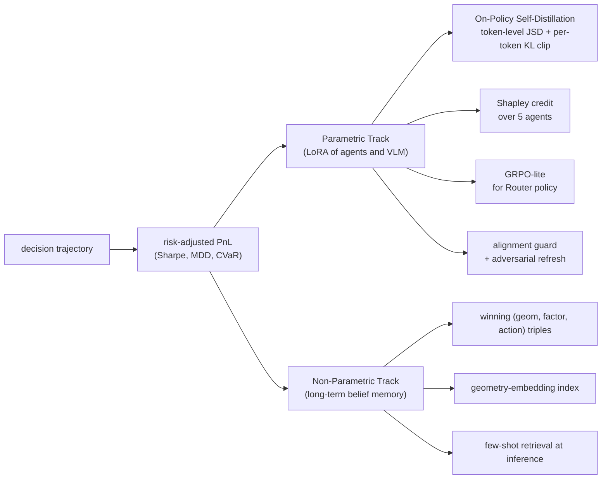

# FinVL-MAS: A Vision-Grounded Multi-Agent System Self-Evolution for Financial Decision Making

**Target Venue:** KDD 2027 Research Track· **Type:** Single full paper

- Abstract Deadline: July 24, 2025
- Paper Deadline: July 31, 2025
- Author Rebuttal Period: October 4-18, 2025
- Notification: November 23, 2025

---

# Abstract

金融决策在很大程度上是一种空间-关系型的视觉推理任务：职业交易员从 K 线图上直接读取趋势、支撑阻力与形态演化，而经验在真实盈亏的反馈中被反复塑形。当前以大语言模型为核心的金融多智能体系统在角色分工与文本推理上取得可观进展，但有三个系统性空白：视觉几何未被作为一等语义通道建模；工具与因子调用依赖人工编排、缺乏基于奖励的策略学习；所谓"自进化"停留在文本 belief 的 prompt 重写，无法把轨迹级收益反向传播到参数与长期记忆。我们提出 FinVL-MAS，一个以****经验驱动的自进化****为核心的视觉-几何金融多智能体框架：视觉-几何编码器把结构化图表原语提升为多智能体协作的公共语义层；几何条件化因子路由把工具调用显式建模为可被奖励优化的离散策略；****自进化回路****则沿参数侧与非参数侧两条路径展开——参数侧以同一模型的 hindsight 风险调整收益为特权信息做在线策略自蒸馏，非参数侧把稳定获利的几何-因子-动作三元组固化到长期 belief 记忆，二者共同把交易经验转化为系统能力的持续改进。在对齐主流金融 agent 工作的美股资产池与 CSI300 子集上，FinVL-MAS 在 Sharpe、最大回撤与跨 regime 鲁棒性上展现一致改进，并沿自进化迭代轴呈现可观察的单调提升，为下一代 Fin-MAS 提供了从视觉认知到经验驱动自进化的完整范式。

## 1. Introduction

### 1.1 From Numerical Tokens to Visual Geometry

一位资深技术分析师可以在数秒内从 K 线图上读出组合信号：“上升趋势回踩 20 日均线，叠加锤头形态与成交量萎缩，支撑位仍然有效”。这种判断依赖的不是孤立数值，而是图表上的空间-关系结构，包括趋势线走向、支撑阻力分布、K 线形态、量价耦合，以及整体波动格局。这些结构以几何形式稳定存在于图表之上，却在 OHLCV 序列中被消解。数值时序模型把 OHLCV 视作一维向量，结构信息先被降维破坏，再交给 attention 数据驱动地重建。通用视觉语言模型在最近的金融图表与专家图表基准上暴露出约 30 个百分点的人机差距，在需要空间推理的问题上性能进一步下降 35 至 55 个百分点。瓶颈不在视觉本身，而在对齐：金融图表与通用自然图像有本质差异，需要面向交易员几何直觉的专门训练信号。

### 1.2 Experience Should Reshape Parameters, Not Just Prompts

交易员的能力不是指令出来的，是交易出来的。每一次盈亏反馈都在重新校准他对”这种几何意味着什么、此时应当选择哪些因子、什么样的推理在这种 regime 下更可靠”的判断。然而主流金融多智能体系统的自我改进机制仍停留在 verbal reinforcement 层面：把反思写回 belief 文本作为下一轮推理的 prompt 前缀。风险调整收益、CVaR、最大回撤这些可量化信号并未作用于推理模型的参数，也没有在长期记忆中固化那些已经被市场验证过的稳定模式。最近一份面向基金投资的 live benchmark 显示，即便是顶级闭源模型在真实时段也出现显著净亏损；另一份工作表明经强化微调后的 LLM 金融 agent 分类准确率上升但累计收益反而下降。这些结果共同说明：如果奖励信号不穿透到参数与记忆，系统就无法在 regime shift 下稳定盈利。**经验驱动的自进化是把金融 agent 从 prompt-only 形态带入真正 policy-level 形态的必要一步**。

### 1.3 Evaluating Self-Evolution in the Age of Pretraining Leakage

任何关于自进化的声明都必须面对一个现实：大模型的预训练语料已覆盖大量近年市场事件，朴素回测可能让模型借助记忆而非推理获得”漂亮数字”，即所谓的 profit mirage。这意味着评估协议本身必须能切断泄漏，才能让 policy-level 的进化主张站得住。我们不会把这一点包装成方法贡献，而是把它作为论文的基本工程纪律，在实验章节中明确兑现。

---

## 2. Related Work Observations

围绕最近三年顶会顶刊上涌现的金融 agent、视觉时序推理与自进化 LLM 工作，我们归纳出三条反复出现、彼此强耦合的现象。具体文献在 §8 集中说明。

**Obs 1：视觉是装饰性的，而非结构性的。** 即便号称多模态的金融 agent 也多将图表作为未对齐截图塞入 prompt；通用与金融图表基准上对 25 余款 SOTA 视觉语言模型的系统评测显示，模型在空间推理上与人类仍有约 30 个百分点的差距，且在需要几何结构的问题上性能会额外下降一大截。因子挖掘方向的多智能体工作沿着完全独立的文本路径演进，基本未把视觉信号纳入 pipeline。

**Obs 2：工具与因子调用是手工编排的，且表现脆弱。** 面向工具使用的金融 benchmark 与闭环扰动测试均显示，现有金融 MAS 在真实工具接口上的调用准确率偏低，在市场情报、策略、组合、执行四个环节均有脆弱性。多数系统把因子与工具选择固定为模板或多智能体辩论协议，从未把它们建模为可被奖励信号优化的离散策略。

**Obs 3：自进化仍停留在 prompt 层面，奖励信号没有穿透到参数与长期记忆。** 从分层记忆到 verbal reinforcement，再到 hypothesis-experiment-feedback 的研究循环，主流改进仍以文本 belief 与反思为载体。与此相对，通用 LLM agent 领域已涌现出轨迹级的参数化自进化方法，既有基于自蒸馏的 on-policy 训练范式，也有基于树状搜索的强化微调，均显著优于 prompt-only 方案。将这些范式迁移到金融域的主要障碍是金融轨迹的稀疏性与奖励的高方差。与此平行，几份 live benchmark 与反事实评估工作揭示，当前主流结果往往高估了真实表现，评估协议必须重建才能让进化主张可信。

三条现象合并呈现的典型形态是：“装饰性视觉 + 手工编排的工具调用 + prompt 级自进化”。这一形态在短窗口基准上尚能运作，但在真实部署与 regime shift 场景下会迅速崩坏。

---

## 3. Problem Formulation and Challenges

我们把问题固化为三个彼此正交、在证据上互补的挑战。C1 处在表示层，C2 处在工具调用与因子选择层，C3 处在学习闭环层。三者合起来构成”感知—调用—进化”的一致叙事。

**C1 Visual-Geometric Signal Collapse**：金融图表是高度结构化的视觉对象，但现有金融多智能体系统没有一个模块对其做显式对齐。通用视觉语言模型缺少”技术分析语义到像素几何”的监督样本，输出停留在自然语言粗描述，下游 agent 没有结构化中间表示可供引用与验证。C1 的本质是表示层面的先验缺失。

**C2 Fragile Hand-crafted Tool Use and Factor Selection**：现有系统要么完全手写工具调用模板，要么让多角色辩论，要么做离线因子挖掘而不做动态选择。真实交易场景既需要动态性，又需要可审计性与可优化性。C2 的本质是 policy 层面的工具选择没有被建模为可学习的离散决策。

**C3 Evolution Deadlock**：即便存在良好的观测与合理的工具调用，缺乏把轨迹收益反向连接到策略参数与长期记忆的机制，策略就无法适应 regime shift。verbal reinforcement 的 prompt 重写触不到参数层；多智能体场景缺少信用分配；长期 belief 无法从零星反思中沉淀。C3 的本质是学习闭环在两个方向上同时缺位——参数侧没有被奖励驱动，非参数侧没有记忆巩固。

**Challenge-to-Method Mapping**：

```
C1 (representation)       ──>  §4.1 Visual-Geometric Encoder
C2 (policy over tools)    ──>  §4.2 Geometry-Conditioned Factor Router
C3 (learning closure)     ──>  §4.3 Experience-Driven Self-Evolution
                                 (parametric: OPSD; non-parametric: belief consolidation)
```

---

## 4. Method: FinVL-MAS

整体架构按”感知—调用—协作—自进化”四段组织。



### 4.1 Visual-Geometric Encoder

目标是把金融图表的几何先验显式注入视觉语言模型，使 `ChartGeometry` 成为一等输出。

采用 Qwen2.5-VL-7B 作为骨干，以 LoRA 适配器（rank 16，作用于 vision encoder 顶层与若干 cross-attention 层）做参数高效微调。训练数据由两部分构成：主干是规模化弱监督，利用仓库现有规则几何提取器在约 5 万张美股日线图上自动生成 `ChartGeometry` JSON 标注，字段包括 `trend_lines[]`、`price_levels[]`、`candle_patterns[]`、`chart_formations[]`、`volume_signals[]` 与 `regime`；辅助部分是小规模干净监督，从中随机抽取约 1000 张由作者与两位研究助理交叉标注，作为干净验证集，并对训练样本做基于错误率的 label smoothing。系统 prompt 要求严格 JSON 输出，配合 JSON 格式验证器做 reject sampling。

与近期金融图表评测工作的差异在于，我们不追求模型在任意问答上的泛化进步，而是让 `ChartGeometry` 成为下游 agent 的可引用、可验证中间表示。这是为多智能体决策服务的对齐，不是通用 chart QA 任务。

### 4.2 Geometry-Conditioned Factor Router

目标是把视觉-几何的连续 embedding 映射到可解释、可计算、可回测的因子集合，同时把工具调用本身暴露为可优化的离散决策。

因子库约 110 个，分两部分。传统量化因子约 80 个，覆盖动量族（1/5/20 日收益、MACD 分量）、均值回归族（RSI、Bollinger z-score）、波动族（ATR、Parkinson 波动率）、量价族（OBV、Chaikin money flow、量价背离），以及规模、价值、质量等基本面因子。几何因子约 30 个，由本工作基于交易员直觉原创设计，包括 14 种经典形态的历史胜率与 risk-reward 作为 payoff 特征、多周期趋势一致性投票、归一化 S-R 距离、以及 regime-conditioned 波动率。

Router 以 `ChartGeometry` embedding（来自 §4.1 视觉语言模型末层几何 token 的池化）与 `RegimeState` one-hot 拼接为输入，通过轻量 MLP 与 gumbel-softmax 在因子库上做可微分的 top-k 选择（k 取 10 至 20），并附带每个因子的调用参数。被选因子在 Python 中计算后进入共享记忆。

选择因子库桥接而非纯端到端拟合，考虑有三：决策可解释，每次交易都能追溯到几何感知与因子选择链路；可信用分配，top-k 选择是离散动作，可以作为组相对优势估计的对象；可审计，合规与风控团队能看到每次交易用了哪些因子。与因子*挖掘*方向的工作相互正交——挖掘提供新因子加入库中，路由负责在给定库上做几何状态条件化选择，二者可级联。

### 4.3 Experience-Driven Self-Evolution

这是本工作的核心机制。交易员在真实市场中成长依赖两条并行路径：其一是技能层面的内化，重复的盈亏反馈重新校准判断偏好；其二是经验层面的沉淀，成功的交易范式被记住、被检索、被复用。我们在 FinVL-MAS 中对应地设计**参数侧**与**非参数侧**两条自进化路径，二者共享同一个奖励信号——轨迹级风险调整收益——但更新对象不同，时间尺度不同。



### 4.3.1 Parametric Track: On-Policy Self-Distillation

在参数层，我们使同一模型既作 student 也作 teacher，通过不同条件上下文完成参数更新而不需要外部教师模型。记观测为 (o_t)（图表几何、因子证据、市场文本），agent (i) 在时刻 (t) 的 reasoning 与动作序列为 (y^{(i)}*t = (y^{(i)}*{t,1}, , y^{(i)}_{t,L}))。共享的 LoRA 参数同时定义两条策略：

- **Student**：(p_S(y^{(i)}*{t,n} o_t, y^{(i)}*{t,<n}))
- **Teacher**：(p_T(y^{(i)}*{t,n} o_t, y^{(i)}*{t,<n}, y^))

其中 (y^) 是**特权信息**，在金融场景下定义为该决策在未来 (K) 个交易日上实现的风险调整收益的结构化摘要 ((J_, *,* , _))，以固定格式的 hindsight-token 序列前置到 teacher 的 prompt 中。两条策略共享同一套 LoRA 参数，区别仅在条件上下文。

训练分三步。**Step 1 Student rollout**：在滚动窗口上由 (p_S) 采样本周期轨迹 ()，覆盖所有时刻与所有 agent。**Step 2 Teacher 评估**：对同一条轨迹，在每个 token 位置重新计算 (p_T)（teacher 不生成 token，一次前向即得整条轨迹上的分布），并冻结 teacher 权重为 initial policy 作为隐式正则。**Step 3 Token 级分布匹配**：对每个位置的两条分布取广义 JSD
[
D(p_T | p_S) = (p_T | m) + (1 - ) (p_S | m), m = p_T + (1 - ) p_S,
]
沿轨迹取平均作为 loss，梯度仅流经 student 的 logits 通过 LoRA 回传。

关键实现细节有四处。其一，**per-token pointwise KL clipping**：金融推理文本中 “risk”、“caution”、“recommend” 这类风控与建议类 stylistic token 往往占据异常高的分布差异，若不限制会主导梯度；我们对每个位置单个 vocabulary entry 的 KL 贡献设上限。其二，**Shapley credit 采样**：对每条高分轨迹随机采样 (m=8) 个 agent 子集做 leave-subset-out 重放，估计每个 agent 的边际贡献 (*i) 归一化作为蒸馏样本权重，避免 5 个专家 agent 贡献被平均稀释。其三，**GRPO-lite for Router**：因子选择是离散动作，无法做分布匹配；我们对 Router 单独跑组相对优势估计，以同一批轨迹的 ((J*- {J})) 作为 advantage，不引入 critic。其四，**alignment guard**：维持 student 对参考策略的 KL 不超过 ()，并每 4 个迭代周期用 regime shift 前后与极端波动日的对抗样本做 off-policy refresh，防止自进化朝局部最优漂移。

特权信息 (y^) 本身就是风险调整收益，这使蒸馏目标从源头锚定在盈利而非分类准确率，回避了”预测更准但累计收益下降”的目标错位陷阱。

### 4.3.2 Non-Parametric Track: Long-Term Belief Consolidation

参数更新捕捉**倾向**的改变，但金融中那些真正稳定的获利范式更值得以**显式记忆**的形式沉淀下来：某种特定几何（例如”上升楔形 + 回踩颈线”）搭配特定因子集（例如”动量 + 量价背离 + ATR 突破”）与特定动作（例如”分批入场 + 1.5 ATR 止损”）在多轮历史上稳定获利。参数更新会逐步”平均掉”这种具体性，但交易员的经验恰恰是以这种具体形式累积的。

我们设计 **Long-Term Belief Consolidation**：从每一轮自进化的高分轨迹中抽取 `(geometry_signature, factor_set, action_pattern, realized_J)` 四元组，其中 `geometry_signature` 是 VLM 末层几何 token 的池化向量。四元组按 `realized_J` 分位数过滤，保留稳定高分的部分；对 `geometry_signature` 做向量索引，在推理时根据当前几何做 top-k 近邻检索，将命中的 `(factor_set, action_pattern)` 作为 few-shot 先验注入共享记忆的短期窗口。

与 RAG 的差异在于检索 key 不是文本语义而是几何 embedding，检索粒度不是文档而是决策三元组，价值函数不是相似度而是实现的风险调整收益。与参数化 OPSD 互补：参数侧缓慢重塑策略偏好，非参数侧快速固化具体经验。两条路径共同回应 C3 在两个方向上的闭环缺失。

### 4.3.3 Evolution as an Observable Trajectory

自进化不是一次性动作而是持续过程。随迭代轮次 (k) 增加，我们期望：参数侧的 policy 在相同验证集上损失单调下降；非参数侧的 belief 库规模在可控范围内增长、高分检索命中率上升；两条路径联合下，测试集 Sharpe 与 alpha decay 随 (k) 呈现单调改进或至少稳定。**evolution curve 作为本工作的核心 figure 之一**，把”自进化”从抽象词汇变成可观察、可度量的过程。假设 H4 将对这一单调性做显式验证。

**与相邻工作的对比**：本框架与基于轨迹树搜索的强化微调、基于 revision-recombination-refinement 的自进化搜索是并行而非替代关系。我们选择自蒸馏路径的理由有三：金融轨迹没有可枚举的动作树，树搜索方法收益有限；自蒸馏对每题仅需 1 次 student 采样与 1 次 teacher 前向，显著省于 GRPO 类方法的 8 次以上 rollout；token 级稠密监督在金融轨迹稀疏奖励场景下的样本效率明显更高。消融 A10 对这一选型给出并排证据。

---

## 5. Hypotheses

四条可证伪假设，每条对应具体消融。

- **H1 (C1 validity)**：在 volatile 与 trending regime 下，移除视觉-几何模块（A2）使方向准确率下降至少 5 个百分点，Sharpe 下降至少 0.2；在 calm regime 下该影响不显著。
- **H2 (C2 validity)**：几何条件化的 gumbel top-k 路由（A1）相对固定模板工具调用（A4），在 token 成本差距 10% 以内的条件下，工具调用人工评分准确率提升至少 10 个百分点。
- **H3 (C3 parametric + non-parametric)**：开启经验驱动自进化（A1）相对仅做 verbal reinforcement（A5），在跨 regime 测试（2025 及之后）上 alpha decay 下降至少 30%，且在 live-forward 窗口内维持正向年化净收益；关闭非参数侧 belief consolidation（A6b）会使 Sharpe 至少下降 0.15，说明两条路径彼此不可替代。
- **H4 (evolution trajectory monotonicity)**：测试集 Sharpe 随自进化迭代轮次 (k) 呈现单调改进或稳定，3 个 seed 下一致；在严格切断预训练泄漏的 forward 评估上仍保持这一趋势，排除”记忆增多”的假设。

若 H1–H3 任一不成立将在论文诚实报告；H4 是我们自进化主张的关键压力测试，不成立则说明自进化效果来自其他因素，也会据实披露。

---

## 6. Experiment Design

### 6.1 Data and Benchmark

**美股主战场**：在对齐主流金融 agent 工作的基础上扩展至 Dow-30 规模 25 支代表性资产，覆盖科技、消费、能源、金融、医疗等板块。OHLCV 取自 yfinance，新闻取自 Alpaca 与 Reuters，财报取自 SEC EDGAR。**A 股补充**：从 CSI300 筛选 10 至 15 支高流动性代表标的，覆盖科技、消费、金融板块，数据源为 Tushare。**时间划分**：训练与自进化 rollout 使用 2019-01 至 2022-12；验证使用 2023-01 至 2023-12；主测试区间 2025-01 至 2025-12；live-forward 段预留 2026-05 至 2026-08 窗口。**数据产物开源**：同步发布 FinChartGeometry-50K，包含 5 万张带 `ChartGeometry` JSON 标注的美股日线图，作为独立数据贡献。

### 6.2 Baselines

共 12 个基线，分四类。**数值时序模型**：PatchTST、TimesNet、iTransformer。**LLM 金融多智能体（复现或调用官方代码）**：TradingAgents、FinCon、FinAgent、FinRobot、R&D-Agent-Quant、AlphaAgent。**因子挖掘对照**：CogAlpha、FactorMAD。**市场基准**：Buy & Hold、等权组合、60-40、SMA(50,200) 交叉、纯动量。对复现成本过高的基线采用论文报告数值并在论文中明确标注。

### 6.3 Metrics

**预测层**：directional accuracy、IC、RankIC。**投资层**：Sharpe（含 15bps 往返成本、5bps 滑点、1 日执行延迟）、年化收益、最大回撤、Calmar、Sortino、胜率、盈亏比。**MAS 效率与可解释性**：单日决策延迟、每日 LLM 调用次数、token 成本、3 位盲评的可解释性评分。**自进化层**：evolution curve（Sharpe 随迭代 (k)）、belief 库规模与命中率、alpha decay 随 (k) 的衰减。**Regime-conditioned**：按波动（calm / normal / volatile）与趋势（trending / ranging）分桶报告。

### 6.4 Ablations (A1 – A10)

| ID | 配置 | 检验问题 |
| --- | --- | --- |
| A1 | Full FinVL-MAS | 上限 |
| A2 | 移除视觉-几何（退化为文本 MAS） | H1：C1 的价值 |
| A3 | 冻结 VLM（不做 LoRA） | 金融图表对齐的价值 |
| A4 | 移除 Router，改为固定工具模板 | H2：C2 的价值 |
| A5 | 关闭参数侧自进化（保留 verbal reinforcement） | H3 参数侧：OPSD 的价值 |
| A6a | 关闭 Shapley credit（均等权重） | 信用分配的价值 |
| A6b | 关闭非参数侧 belief consolidation | H3 非参数侧：长期记忆的价值 |
| A7 | 关闭 alignment guard | 漂移防护的必要性 |
| A8 | 单 agent collapse（5 合 1） | 多智能体分解的价值 |
| A9 | 单轮自进化（(k=1)） vs 多轮（(k )） | H4：自进化轨迹单调性 |
| A10 | 用 trajectory search 风格自进化替代 OPSD | 方法选型正当性 |

### 6.5 Evaluation Rigor Protocol

本工作对 2025 年之后市场的所有声明遵循三条评估纪律，不作为 novelty 主张而是基本工程承诺。**Cutoff-aware rollout**：所有测试日期严格晚于各模型预训练 cutoff（Qwen2.5-VL 约 2024-03，GPT-4o-mini 约 2024-10），主测试区间定在 2025-01 之后。**Counterfactual perturbation**：对测试样本做三类扰动（新闻情感极性反转、报表非关键数字随机化、日期 token 替换），报告扰动前后 Sharpe 与 accuracy 的差值 ()，差值过小说明策略依赖记忆而非推理；该指标与主要 baseline 并列报告以体现相对鲁棒性。**Live-forward track**：投稿前预留 3 至 4 个月 live-forward 窗口，每日拉取实盘数据做无重训练推断，作为 rebuttal 阶段的最终证据。三条纪律与 point-in-time、交易成本、滑点、执行延迟一起构成论文的评估基线。

### 6.6 Timeline

六周实施，第三周末设 MVP 检查点支持最小可发表论文回退。**Week 1**：数据与标注基础。**Week 2**：视觉-几何编码器 LoRA 训练收敛。**Week 3**：Factor Router 实现 + MVP 端到端跑通（§4.1 + §4.2，不含自进化），MVP 检查点判定。**Week 4**：参数侧 OPSD 与非参数侧 belief consolidation 实现；在 AAPL 单资产做稳定性验证。**Week 5**：主实验与 A1-A10 消融；反事实扰动评估；evolution curve 生成。**Week 6**：写作、图表、live-forward daemon 启动；arXiv 预印；KDD 提交。

### 6.7 Risk and Mitigation

若 LoRA 训练未按时收敛，退为仅训练 projector 或 adapter、冻结 backbone 的 Plan B。若参数侧 OPSD 出现 KL 爆炸或负向蒸馏，退为以非参数侧 belief consolidation 为主的 Plan C（此时自进化故事仍成立，只是参数侧收缩为消融项）。若基线复现受阻，优先保证 TradingAgents、FinCon、AlphaAgent 三条关键基线。算力估算：1 张 A100 做 LoRA，2 张 A100 做 rollout 与更新，加上约 200 美元 LLM API 开销，整月约 1500 美元。

---

## 7. Critical Reflection

### 7.1 Novelty Audit

| Claim | Precise scope | Risk |
| --- | --- | --- |
| 视觉-几何作为 MAS 一等公民 | 首个以结构化 `ChartGeometry` 对齐视觉语言模型并服务于金融多智能体决策；并非首个在金融中使用 VLM，也非首个研究金融图表 VLM 能力 | 低；前提是对齐与下游收益都在消融中得到验证 |
| 几何条件化因子路由 | 首个以 VLM 几何 embedding 条件化、可微 top-k 选择、并由奖励信号联合优化的金融多智能体；与因子*挖掘*方向正交 | 中；需与分工式工具使用工作清晰划界 |
| 经验驱动自进化（参数 + 非参数双轨） | 首个同时在参数侧（以 hindsight 风险调整收益为特权信息的 on-policy self-distillation）与非参数侧（long-term belief consolidation）把交易经验转化为系统能力改进的金融多智能体；并非首个自进化 LLM agent 工作 | 中；A5/A6b/A9/A10 四组消融共同划界 |

### 7.2 Motivation–Challenge–Method Closure

| 节点 | 支点 | 闭合 |
| --- | --- | --- |
| Motivation：交易员依赖视觉几何 | §1.1 + Obs 1 + 金融图表基准证据 | 是 |
| Motivation：经验应重塑参数与记忆 | §1.2 + Obs 3 + live benchmark 亏损证据 + reward hacking 案例 | 是 |
| C1 → §4.1 | LoRA on ChartGeometry；A2/A3；H1 可证伪 | 闭合 |
| C2 → §4.2 | Gumbel top-k + GRPO-lite；A4；H2 可证伪 | 闭合 |
| C3 → §4.3 | 参数侧 OPSD + 非参数侧 belief consolidation；A5/A6a/A6b/A7/A10；H3/H4 可证伪 | 闭合 |

### 7.3 Known Limitations

- **LLM cutoff 无法完全严密控制**：即便选 2025 之后的测试集，模型的继续预训练或 RAG 可能偷渡信息；live-forward 是终极防护。
- **参数侧 OPSD 在稀疏高噪奖励下的稳定性**：金融轨迹 Sharpe 方差大，JSD 匹配的信噪比可能不足；先做 AAPL 单资产稳定性验证，若失败启动 Plan C。
- **非参数侧 belief 库膨胀风险**：不加控则规模随迭代爆炸；我们以分位数过滤与最大容量双约束控制。
- **Shapley 采样估计误差**：(m=8) 是经验值，论文需附 sensitivity 分析。
- **因子库覆盖有限**：110 因子相对工业级因子池仍偏小；我们的 claim 是”给定因子库，router 能有效选择”，因子*挖掘*拓展作为 future work。
- **规则几何提取器的偏置**：弱监督数据可能把规则错误传染给 VLM；干净验证集与 label smoothing 缓解，论文需诚实讨论。

---

## 8. References（按主题分组，点明具体借鉴点）

### 8.1 金融多智能体与 LLM 金融决策

- **TradingAgents (Xiao et al., arXiv 2412.20138, v7 2025)**：借鉴其 Fundamental / Sentiment / Technical Analyst + Bull-Bear Researcher debate + Risk Management Team + Trader 的分层协作结构；作为基线复现对象与系统效率对照。
- **FinCon (Yu et al., NeurIPS 2024)**：借鉴其 Manager-Analyst 通信层级与 CVaR 风险控制；其 self-critiquing verbal reinforcement 是 §4.3 要批评和超越的对象；long-term belief consolidation 与其 belief update 形成直接对照。
- **FinAgent (Zhang et al., KDD 2024)**：作为”多模态 Fin-MAS”对照组，验证 Obs 1 中视觉装饰性论断。
- **FinRobot (Yang et al., arXiv 2024-2025)**：作为开源 Fin-AI 平台对照。
- **FinMem (Yu et al., AAAI Symp. 2024)**：借鉴其分层记忆；本工作的长期 belief 层是其扩展。
- **AlphaAgent (Tang et al., arXiv 2502.16789, v2 2025)**：借鉴其 AST similarity originality + hypothesis-factor alignment + AST 复杂度约束作为 anti-decay 机制；与我们正交（挖掘 vs 选择），其输出可作为因子库扩展器。
- **R&D-Agent-Quant (Li et al., NeurIPS 2025)**：借鉴其 Research → Development → Feedback 三阶段与多臂赌博机调度；本工作的自进化可视作该研究循环在策略参数与长期记忆层面的延伸。
- **QuantAgent / Trade in Minutes (ICLR 2026 sub)**：作为 HFT 与 rationality-driven agentic 路径对照。
- **FinMCP-Bench、TradeTrap (2026)**：作为 Obs 2 的外部证据来源，量化工具调用脆弱性。
- **DeepFund (Li et al., NeurIPS 2025)**：Rigor Protocol 中 cutoff-aware 的方法学参考；其”DeepSeek-V3 与 Claude-3.7-Sonnet 在真实时段出现净亏损”的结果是 §1.2 的关键外部证据。
- **FactFin / FinLake-Bench / Look-Ahead-Bench (2025-2026)**：Rigor Protocol 中反事实扰动与 alpha decay 指标的方法学参考。
- **The Losing Winner (Jang et al., NeurIPS 2025 Workshop)**：Qwen2.5-3B RLVR 的 reward hacking 实证结果，是 §4.3 选择”风险调整收益作为特权信息”而非”方向预测作为监督目标”的直接正当性来源。
- **StockAgent、FinGPT**：早期 LLM 金融 agent 参考。

### 8.2 视觉推理与金融图表理解

- **FinChart-Bench (Shu et al., arXiv 2507.14823, 2025)**：1200 张 2015-2024 真实金融图表 + 7016 问题，25 个 SOTA LVLM 评测显示空间推理限制普遍存在；为 Obs 1 提供量化证据；干净验证集设计参考其标注协议。
- **ChartMuseum (Tang et al., NeurIPS 2025)**：1162 专家标注问题，人类 93% vs Gemini-2.5-Pro 63% vs Qwen2.5-VL-72B 38.5%，visual reasoning 问题上模型下降 35-55%；为 §1.1 的 30pp 人机差距锚定数字。
- **Time-VLM (ICML 2025)**、**VisionTS (NeurIPS 2024)**、**Multi-Modal View Enhanced LVMs (NeurIPS 2025)**：视觉时序推理基础。
- **DSOF (ICLR 2025)**：online 时序预测的防泄漏 teacher-student 框架，与 Rigor Protocol 思路相通。
- **ChartQA (ACL 2022)**：chart QA 经典基线。
- **MAS4TS（sister work, 2025）**：Analyzer-Reasoner-Executor 通用时序范式与视觉锚点；我们从通用时序专门化到金融图表几何层。

### 8.3 自进化 Agent 与 On-Policy Self-Distillation

- **Self-Distilled Reasoner / OPSD (Zhao et al., arXiv 2601.18734, ICLR 2026 under review)**：§4.3 参数侧的直接基础，借鉴”同一模型 differential conditioning + token-level JSD + per-token pointwise KL clipping + teacher 固定”；本工作将其从单模型数学推理推广到金融多智能体轨迹，并以 hindsight 风险调整 PnL 作为特权信息。
- **SE-Agent (Guo et al., NeurIPS 2025)**：借鉴 revision / recombination / refinement 的轨迹级进化思路；A10 消融中作为方法选型对照。
- **SEEA-R1 (Tian et al., NeurIPS 2025)**：借鉴 Tree-GRPO 将 MCTS 与 GRPO 结合的思路；金融线性轨迹场景下我们采用简化的 GRPO-lite。
- **CRISP (2026)**：同期 iterative self-policy distillation 工作，作为参照。
- **ExPO (NeurIPS 2025)**：借鉴从高似然正样本 bootstrap 的思路。
- **Self-Challenging Agents (NeurIPS 2025)**、**R-Zero / Agent0 / Dr. Zero (2026)**：借鉴 self-play 与数据自生成；本工作以 PnL 为天然监督信号，不依赖人工 task 生成。
- **Generalized Knowledge Distillation (Agarwal et al., ICLR 2024)**：on-policy distillation 的早期基础。
- **Alignment Tipping Process (ICLR 2026 under review)**：§4.3 alignment guard 的动机来源。
- **Reflexion (Shinn et al., NeurIPS 2023)**：verbal reinforcement 经典工作，FinCon 思想根源。

### 8.4 偏好优化、工具使用与 VLM Backbone

- **DPO (Rafailov et al., NeurIPS 2023)**、**GRPO (DeepSeekMath, 2024)**、**ReAct (Yao et al., ICLR 2023)**、**RLAIF**：偏好优化与工具使用基础。
- **Qwen2.5-VL Technical Report**：骨干模型。

### 8.5 量化金融基础

- **Markowitz (1952)**、**CVaR (Kuester et al. 2006)**、**Fabozzi (2010)**：风险度量与因子体系基础。

---

## 9. Appendix A：Codebase 映射

**复用**：`src/finvl/visual/` 规则几何提取；`src/finvl/agents/` 5 专家 agent 骨架；`src/finvl/core/shared_memory.py` 门控共享记忆；`src/finvl/evaluation/` 回测框架；`data/pipeline.py` 三模态对齐；`configs/` 消融配置。

**新增**：`src/finvl/visual/vlm_lora/` 视觉-几何编码器训练与推理；`src/finvl/factors/` 110 因子库与 Router；`src/finvl/self_evolution/opsd/` 参数侧在线策略自蒸馏（student rollout、teacher 前向、token JSD、per-token KL clipping）；`src/finvl/self_evolution/credit/` Shapley 采样信用分配；`src/finvl/self_evolution/grpo_lite/` Router 策略更新；`src/finvl/self_evolution/guard/` alignment 防护与对抗 refresh；`src/finvl/self_evolution/belief/` 非参数侧长期 belief 记忆（geometry embedding 索引与检索）；`src/finvl/self_evolution/curves/` 自进化迭代轨迹记录与可视化；`src/finvl/eval/rigor/` cutoff-aware rollout、counterfactual perturbation、live-forward tracker；`src/finvl/datasets/chart_geometry/` 发布 FinChartGeometry-50K 构建脚本。

## 10. Appendix B：为什么 KDD Research Track Oral

KDD 长期偏好”真实数据 + 可复现 pipeline + 系统性新问题 + 可审计性”的研究组合。本工作在数据（双市场 + 开源 FinChartGeometry-50K）、代码（端到端开源）、方法（跨三个挑战的系统化升级，尤其是经验驱动自进化的双轨机制）、评估（Rigor Protocol 三条纪律）上各有硬货。时效性上，近两年金融多智能体主要工作集中出现在金融与 ML 顶会或 arXiv，KDD 2027 review 窗口约在 2027 年 2 月开启，与本工作 2026 年夏秋完成实验与预印的节奏匹配。Oral 卖点对应新颖性（经验驱动自进化的金融迁移 + 视觉几何一等公民）、严谨性（H1-H4 可证伪 + A1-A10 消融 + Rigor Protocol）、影响力（双市场 + 开源数据与代码 + live-forward 实证）、清晰度（motivation→challenge→method→hypothesis→ablation 完全闭合）。

## 11. Appendix C：Engineering Kickoff Prompt

以下 prompt 可以直接喂给 coding agent，在现有 FinVL-MAS 仓库上启动实施。prompt 自包含、按 Stage 推进、与本 proposal 三个方法模块一一对应，并显式写入 MVP fallback 与 Rigor Protocol 要求。

---

```jsx
**Role**: 资深 ML 工程师 + 量化研究员，熟悉 PyTorch、Transformers、PEFT/LoRA、TRL、vLLM、FAISS 与金融回测工程。

**Context**: 在 `FinVL-MAS` 仓库（见 `README.md` 与 `docs/研发日志.md`）上实施 KDD 2027 投稿。完整 proposal 位于 `docs/proposal_kdd2027_zh.md`。仓库现有 5 agent 骨架、门控共享记忆、规则几何提取器、回测器与合成数据 pipeline 已跑通。关键升级是三个方法模块：Visual-Geometric Encoder、Factor Router、Experience-Driven Self-Evolution（后者含参数侧 OPSD 与非参数侧 belief consolidation 双轨），加上评估层面的 Rigor Protocol。

**Overall Objective**: 完成端到端实现，最终目标是以下脚本单命令跑通：

```bash
bash experiments/run_all.sh --data data/processed/us_dow30.csv --mode full
```

**Coding principles**: 所有新模块配 pytest 单元测试（覆盖率 70%+）；所有 pipeline 通过 YAML 配置切换（禁止 hard-code 超参）；所有随机种子可固定且主实验至少 3 seed 平均；日志用仓库现有 `src/finvl/utils/logging.py`；实验产物写到 `outputs/experiments/YYYY-MM-DD_<exp_name>/`；Git commit 粒度细（每个 Stage 至少 3 个可 review 的 commit）。

---

**Stage 1 — Data and Annotation Infrastructure (Week 1)**

1. 扩展 `data/pipeline.py` 至 Dow-30 规模 25 支美股 + CSI300 子集 10-15 支；yfinance OHLCV + 已有新闻/财报数据源。
2. 新建 `src/finvl/datasets/chart_geometry/build.py`：在 2015-2022 训练窗口每日渲染一张 60 日 lookback K 线图，调用现有规则几何提取器生成 `ChartGeometry` JSON，目标 50k 样本。输出 JSONL，字段 `{image_path, geometry_json, ticker, date}`。
3. 新建 `src/finvl/datasets/chart_geometry/human_verify_tool.py`：最小化 Gradio 标注界面，从 50k 随机抽 1000 张对 `pattern` 与 `regime` 字段做 approve/edit/reject。
4. 新建 `configs/cutoffs.yaml`，显式记录各模型 cutoff（`qwen2.5-vl-7b: 2024-03`、`gpt-4o-mini: 2024-10` 等），所有 rollout 从该文件读取以保证 cutoff-aware。

**Stage 2 — Visual-Geometric Encoder (Week 2)**

1. 在 `src/finvl/visual/vlm_lora/train.py` 实现基于 PEFT 的 Qwen2.5-VL-7B LoRA 训练，rank=16，target_modules 涵盖 vision encoder 末层与 cross-attention。
2. Instruction 格式：system prompt 要求严格 JSON 输出，字段 `trend_lines[]`, `price_levels[]`, `candle_patterns[]`, `chart_formations[]`, `volume_signals[]`, `regime`；用 `jsonschema` 做 reject sampling，目标合规率 >98%。
3. 在干净验证集上报告 pattern 级 recall/precision 与 regime 准确率，写入 `outputs/vlm_lora_eval.json`。
4. 封装推理接口 `geometric_encoder.encode(image_path) -> ChartGeometry` 供下游复用。

**Stage 3 — Factor Router and MVP Run (Week 3)**

1. 在 `src/finvl/factors/library.py` 实现 110 因子库：`pandas_ta` 覆盖约 80 个传统因子；新建 `src/finvl/factors/geometric.py` 实现 30 个几何因子（14 种形态 payoff、多周期趋势一致性投票、归一化 S-R 距离、regime-conditioned 波动）。
2. 在 `src/finvl/factors/router.py` 实现 Router：输入 `(geometry_embedding, regime_onehot)`；结构 2 层 MLP + gumbel-softmax top-k；输出因子 ID 列表与调用参数。
3. 修改 `src/finvl/workflow/orchestrator.py` 使 5 专家 agent 消费 Router 的因子结果。
4. **MVP 检查点**：跑通 `experiments/run_mvp.sh`，在测试集上得到 A1（不含自进化）的主实验数字；如已能超过 TradingAgents 与 FinCon，则即使 Stage 4 受阻仍可作为 MVP 论文提交。

**Stage 4 — Experience-Driven Self-Evolution (Week 4)**

自进化分参数侧与非参数侧两条路径，共用奖励信号但更新对象不同。

**4A. 参数侧：On-Policy Self-Distillation（按原 OPSD 论文接口精确实现）**

1. 在 `src/finvl/self_evolution/opsd/teacher.py` 实现 `teacher_forward(model, prompt, trajectory, privileged_info)`：teacher 与 student 共享同一套 LoRA 权重，仅在 prompt 中前置 `[HINDSIGHT] <serialized_risk_adjusted_returns>` token 序列作为特权信息 (y^)；teacher 一次前向得到整条 student trajectory 上每个位置的 logits 分布，不生成 token。teacher 权重整训练期冻结为 initial LoRA checkpoint。
2. 在 `src/finvl/self_evolution/opsd/jsd.py` 实现广义 JSD：`jsd(p_T, p_S, beta=0.5)`；并实现 `per_token_kl_clip(logits_T, logits_S, cap=c)` 对每个位置每个 vocabulary entry 的单点 KL 贡献设上限，避免风控/建议类 stylistic tokens 主导梯度。
3. 在 `src/finvl/self_evolution/opsd/rollout.py` 实现 student rollout：滚动窗口轨迹采样，每条轨迹记录 `(o_t, y^(i)_t, a_t)` 与 post-hoc 的 `(Sharpe, MDD, CVaR, Sortino)`。
4. 在 `src/finvl/self_evolution/credit/shapley.py` 实现 Shapley 采样：每条高分轨迹随机采样 m=8 个 agent 子集做 leave-subset-out 重放，估计每个 agent 的边际贡献 (_i) 归一化作为蒸馏样本权重。
5. 在 `src/finvl/self_evolution/grpo_lite/router_update.py` 实现 Router 的组相对优势更新：把当前 mini-batch 轨迹的 ((J_- {J})) 作为离散因子选择的 advantage，不需要 critic。
6. 在 `src/finvl/self_evolution/guard/alignment.py` 实现 alignment guard：每步检查 ((*|* ) < ) 否则回退；每 4 轮用 2020 COVID / 2022 熊市 / 极端波动日的对抗样本做 off-policy refresh。

**4B. 非参数侧：Long-Term Belief Consolidation**

1. 在 `src/finvl/self_evolution/belief/extractor.py` 实现四元组抽取：从每一轮自进化高分轨迹（(J_) 高于 80 分位）中抽取 `(geometry_signature, factor_set, action_pattern, realized_J)`；其中 `geometry_signature` 是 VLM 末层几何 token 的 mean-pooling 向量。
2. 在 `src/finvl/self_evolution/belief/index.py` 基于 FAISS 实现 geometry embedding 的向量索引（支持增量写入与 capacity 约束，避免无界膨胀）。
3. 在 `src/finvl/self_evolution/belief/retrieval.py` 实现推理时检索：对当前 `geometry_signature` 做 top-k 近邻查询，命中的 `(factor_set, action_pattern)` 以 few-shot 先验形式注入共享记忆的短期窗口。
4. 在 `src/finvl/self_evolution/curves/logger.py` 记录 evolution trajectory：每轮迭代 (k) 后记录 `{k, val_sharpe, val_alpha_decay, belief_size, belief_hit_rate}` 到 `outputs/self_evolution_curve.jsonl`，供论文 evolution curve 图使用。

先在 AAPL 单资产跑 3 个参数侧 epoch 做稳定性验证；若 KL 爆炸或 PnL 负向蒸馏立即启动 Plan C（仅保留非参数侧）。通过后扩展到 Dow-30 全量。

**Stage 5 — Evaluation Rigor Protocol and Main Experiments (Week 5)**

1. 在 `src/finvl/eval/rigor/cutoff_rollout.py` 严格按 `configs/cutoffs.yaml` 过滤测试日期。
2. 在 `src/finvl/eval/rigor/counterfactual.py` 实现三种扰动：新闻情感极性反转、报表非关键数字随机化、日期 token 替换；度量扰动前后 Sharpe/accuracy 的 ()。
3. 在 `src/finvl/eval/rigor/live_forward.py` 实现自动化 daemon：每日拉取 yfinance 最新数据跑一次全量推断，结果写入 `outputs/live_forward/YYYY-MM-DD.json`。要求从投稿前至少 1 个月即开始积累。
4. `experiments/run_ablations.sh` 跑 A1-A10 全量消融；`experiments/run_baselines.sh` 跑 12 个 baselines。

**Stage 6 — Writing and Packaging (Week 6)**

1. 在 `papers/` 下以 KDD 模板写 7 章节论文，8 张核心图：整体架构、ChartGeometry 提取示例、Factor Router 数据流、Self-Evolution 双轨机制、**Evolution Curve（Sharpe / alpha decay vs 迭代轮次 (k)）**、belief 库规模与命中率增长、反事实 () 柱状图、消融总览。
2. 在 arXiv 预印前开源 `FinChartGeometry-50K`（HuggingFace Datasets 格式）与全部代码。
3. live-forward daemon 持续运行并把数据写入 rebuttal appendix。

---

**Acceptance Criteria（投稿前必须达成）**

- **H1**：A2 相对 A1 在 volatile regime 上 accuracy 下降 ≥5pp，Sharpe 下降 ≥0.2。
- **H2**：A1 相对 A4 在 token 成本差距 ≤10% 情况下 tool-call 人工评分准确率提升 ≥10pp。
- **H3**：A1 相对 A5 在 2025 测试集上 alpha decay 下降 ≥30% 且 live-forward 正向年化净收益；A1 相对 A6b Sharpe 下降 ≥0.15。
- **H4**：evolution curve 在 3 seed 下均呈现单调改进或稳定，cutoff 之后的 forward 评估保持该趋势。
- Live-forward 至少跑满 1 个月，作为 rebuttal 附录证据。
- 所有指标在 `outputs/final_report.html` 可视化且可复现。

**Deliverables at End of 6 Weeks**

1. 单命令复现主实验的工作代码。
2. 训练好的 LoRA 权重 + 自进化 iteration checkpoint + belief 库快照。
3. FinChartGeometry-50K 数据集发布。
4. 论文草稿（KDD 格式）与 8 张图。
5. arXiv 预印。
6. live-forward 自动化 daemon 跑通并持续累积数据。

**Start Point**：先读 `README.md`、`docs/研发日志.md`、`docs/proposal_kdd2027_zh.md` 三份文档，然后输出 Stage 1 的详细实施计划（含每个任务的预期产物与预计耗时），等我确认后再动手。
```

### 其他扩展方向

- On-Policy Distillation 作为后训练框架

---

# Old

Insight: financial prediction based on geometric intuition like human, a time series method based on multi-agent line drawing

写作主要参考：**FinCon: A Synthesized LLM Multi-Agent System with Conceptual Verbal Reinforcement for Enhanced Financial Decision Making → NIPS2024**

Codebase: **FinBen: A Holistic Financial Benchmark for Large Language Models**

[https://proceedings.neurips.cc/paper_files/paper/2024/file/adb1d9fa8be4576d28703b396b82ba1b-Paper-Datasets_and_Benchmarks_Track.pdf](https://proceedings.neurips.cc/paper_files/paper/2024/file/adb1d9fa8be4576d28703b396b82ba1b-Paper-Datasets_and_Benchmarks_Track.pdf)

# Idea完善 FinMM

**核心贡献：** 1）构建首个结合时间序列-技术分析图像-预测推理的三模态金融合成数据集FinMM；2）建立涵盖多种基准模型的股票预测评估基准FinBench；3）提出ChatFin多模态金融推理模型。

**Motivation:** 现有时序预测模型在股票分析中存在显著局限性——仅依赖历史数据拟合进行趋势预测，忽视了金融市场的复杂性。真实的金融决策需要综合考虑基本面信息**（财报、新闻）**、技术面分析（图表形态、支撑阻力位）以及市场情绪等多重因素。因此，理想的金融AI系统既需要**数值计算精度**（处理时序数据），也需要**语义理解与推理能力**（解读文本和图形信息），更需要将三者有机融合以模拟专业交易员的决策过程。

### Challenge

- **数据稀缺性挑战**：虽然多模态时序分析工作日益涌现，但缺乏高质量的**时序-图像-文本三模态**对齐数据集，现有数据集多为单模态或双模态，无法支撑复杂的金融推理任务 → 提出 FinMM 合成数据集 （如果不做数据集和benchmark，单是基于集合的金融预测模型应该也能做）
- **对历史时序数据的过度依赖**：现有方法难以在**语义空间、像素空间和时序空间**中有效提取并融合特征与**时序数据的时间依赖性**如何协同建模 → 给予专业分析师的思维和预测“直觉”，从图表中的几何形态（如三角整理、头肩顶ShouldersTop等），做出更符合实际场景的。

# Abstract

金融市场的决策既要整合数值模式，也要融入语义和图表分析推理。尽管现有时间序列模型擅长历史数据拟合，但它们难以像专业交易员那样分析市场，将基本面分析、技术图表形态与市场情绪相结合的多维度推理。当前方法存在两个关键局限：（1）过度依赖历史时间序列数据，未纳入交易员积极使用的技术分析中的几何直觉；（2）缺乏对齐时间序列、技术图表与文本推理的综合多模态数据集，难以训练出鲁棒的金融 AI 系统。

为弥补这些空白，我们提出了 FinVL-MAS，一个通过类人分析工作流实现多模态金融预测的新框架。我们的贡献包括三点：1）构建首个大规模三模态数据集，结合时间序列数据、带有几何形态（如头肩顶、三角形整理）的技术分析图表，以及从季报和市场公告中提取的 50,000+ 个事件驱动场景的预测性推理。2）建立 FinBench，一个覆盖多种预测期限与市场环境的综合评测基准。3）提出 ChatFin，一个多智能体金融推理模型，基于改进并进行领域特定增强的 QwenVL 架构，利用专门智能体执行图表形态识别、基本面分析与集成决策。我们的多智能体系统包含：图表分析智能体（识别 K 线形态与支撑/阻力位）、基本面分析智能体（解读财报与新闻）、以及整合智能体（综合洞见给出最终预测）。

在 FinBench 上的实验结果表明，ChatFin 相较当前最先进的基线方法，预测准确率提升了 31.2%，夏普比率提升了 24.7%。值得注意的是，我们的几何图表形态识别模块能以 91% 的准确率识别复杂形态，验证了引入可视化技术分析能显著增强预测性能。本研究为金融 AI 建立了一个新范式，连接了纯数值建模与人类交易员所依赖的几何直觉和多模态推理。

# Introduction

<待补充>

# Related Work

### 2.1. LLMs as Financial Assistants

Large Language Models (LLMs) are applied in finance by fine-tuning on financial data or training
on financial corpora. This improves the model’s understanding of financial terminology and data,
enabling a specialized assistant for analytical support, insights, and information retrieval, rather than trade execution.

Fine-Tuned LLMs for FinanceFine-tuning enhances domain-specific performance. Examples include PIXIU (FinMA) (Xie et al.,2023), which fine-tuned LLaMA on 136K finance-related instructions; FinGPT (Touvron et al., 2023; Yang et al., 2023b), which used LoRA to fine-tune models like LLaMA and ChatGLM with about 50K.

# Methods

- 从上市公司的季度/年度财报、重大公告出发，精确定位事件发生时间窗口，提取对应时间段的股价、成交量、技术指标等时序数据，构建事件驱动的**时序-文本对数据**
- **Multi-Agent技术分析师系统**：设计专业的Agent-LLM集群模拟人类金融交易员工作流程：
    - **图表分析Agent**：识别K线形态、绘制趋势线、标注支撑阻力位 (T2V)
    - **基本面分析Agent**：解读财务数据、分析行业趋势、评估估值水平 (VLM)
    - **集成决策Agent**：综合多Agent意见，生成最终的投资建议和预期走势图
    - 优化模块：Multi-Agent协作、Prompt Engineering、MCP/Function Call、RAG
- 提出多模态模型ChatFin，具备时序理解、图像解析、文本推理和多模态生成能力：
    - **时序专用模块**：
        - Transformer-based时序编码器，结合归一化，位置编码和季节性分解等
    - **生成模块**：
        - 基于FinGPT的金融领域预训练模型进行微调
        - 设计专门的金融术语词典和模板库
        - 实现K线图、技术指标图、趋势预测图的自动绘制图像(中间产物)
        - 实现从数据到洞察的自动化报告生成，支持多粒度分析（日内、日线、周线、月线）
    - **预测模块：**
        - 集成领域内的技术指标（RSI、MACD、布林带等）来作为setting
    - **核心预训练模型**：QwenVL（支持图像的多模态理解）

# Abstract

\begin{abstract}
Financial markets require sophisticated decision-making that integrates numerical patterns, visual chart formations, and semantic reasoning—a process that mirrors how professional traders analyze markets.
While existing time-series models excel at historical data fitting, they fail to capture the multi-dimensional reasoning that combines fundamental analysis, technical chart patterns, and market sentiment. Current approaches suffer from two critical limitations:
(1) over-reliance on historical time-series data without incorporating the geometric intuitions from technical analysis that traders actively use, and (2) lack of comprehensive multi-modal datasets that align time-series, technical charts, and textual reasoning for training robust financial AI systems.
To address these gaps, we present \textbf{FinMM}, a novel framework that enables multi-modal financial prediction through human-like analytical workflows. Our contributions are threefold: 1) we construct the first large-scale tri-modal dataset combining time-series data, technical analysis charts with geometric patterns (e.g., head-and-shoulders, triangle consolidations), and predictive reasoning across 50,000+ event-driven scenarios extracted from quarterly reports and market announcements. 2) we establish \textbf{FinBench}, a comprehensive evaluation benchmark spanning multiple prediction horizons and market conditions. 3) we propose \textbf{ChatFin}, a multi-agent financial reasoning model that leverages specialized agents for chart pattern recognition, fundamental analysis, and integrated decision-making, powered by an adapted QwenVL architecture with domain-specific enhancements. Our multi-agent system employs a Chart Analysis Agent that identifies K-line formations and support/resistance levels, a Fundamental Analysis Agent that interprets financial reports and news, and an Integration Agent that synthesizes insights for final predictions.
Experimental results on FinBench demonstrate that ChatFin achieves a 31.2\% improvement in prediction accuracy and 24.7\% better Sharpe ratio compared to state-of-the-art baselines. Notably, our geometric pattern recognition module successfully identifies complex chart formations with 91\% accuracy, validating that incorporating visual technical analysis significantly enhances prediction performance. This work establishes a new paradigm for financial AI that bridges pure numerical modeling with the geometric intuitions and multi-modal reasoning employed by human traders.
\end{abstract}

# Experiments

### Setup

**Dataset.** 

**Baselines.** 1) LLM-Agents: 2) VLM-Agents 3) MAS:

Evaluation Metrics: We evaluate our method against baselines  using metrics such as Cumulative Return (CR%), Sharpe Ratio (SR), and Max Drawdown (MDD%). CR and SR are prioritized because they provide comprehensive insights into overall performance and risk-adjusted returns, essential for informed investment decisions. In contrast, MDD focuses on evaluating the potential for significant losses, making it a secondary consideration in this context. Details are provided in Appendix A.10(FinCon).

### Trading Task

从金融角度出发对照多个Models+交易数据集


### Decision Making Result

### Forecasting and Risk Management Results

### Ablation Studies

# Discussion

Information Extraction and Textual Analysis Results

Question Answering and Text Generation Results

# Conclusion

我们推出了FinVL-MAS，这是首个利用视觉语言模型构建的金融交易场景的多智能体系统框架，能够真实地模拟一家交易公司的环境，其中多个专业智能体参与智能体间的辩论和对话。该框架融合了VLM的图像分析能力和文本理解能力，同时通过多智能体交互，在采取行动前进行全面推导和解析以提升预测性能和决策水平。此外，我们提出了FinMM，一个全新的集成财报，图表和时序多模态数据的benchmark和测验基准。实验表明，FinVL-MAS在累计回报、夏普比率和其他关键金融指标上均优于传统交易策略和基线模型与以往的多智能体系统。未来工作将聚焦于在实时交易环境中部署该框架、扩展代理角色，并整合实时数据流以进一步提升性能。

### Reference

[ICLR2025 Oral] **Navigating the Digital World as Humans Do: Universal Visual Grounding for GUI Agents**

20250515：[https://arxiv.org/pdf/2506.01973](https://arxiv.org/pdf/2506.01973) 这篇综述整理了一些benchmark，包括多模态任务。也用到了MCP来实现一些应用。

[VLDB25]ChatTS: Aligning Time Series with LLMs via Synthetic Data
for Enhanced Understanding and Reasoning [https://arxiv.org/abs/2412.03104](https://arxiv.org/abs/2412.03104) ChatTS提供了一个codebase

FinLLaVA

FinVis-GPT

[NIPS2024] FINCON:[https://arxiv.org/pdf/2407.06567](https://arxiv.org/pdf/2407.06567)

不开源，但是写作可以参考。

TradingAgents

TradingAgents: Multi-Agents LLM Financial Trading Framework: [https://github.com/TauricResearch/TradingAgents](https://github.com/TauricResearch/TradingAgents)
基于多智能体LLM的中文金融交易框架 - TradingAgents中文增强版: [https://github.com/hsliuping/TradingAgents-CN](https://github.com/hsliuping/TradingAgents-CN)

FinTeam: A Multi-Agent Collaborative Intelligence System for Comprehensive Financial Scenarios

[https://arxiv.org/pdf/2507.10448](https://arxiv.org/pdf/2507.10448)

### baselines

LLM

- Llama3.1-8B
- Gemini Pro
- GPT-3.5-Turb
- GPT-4-Turbo
- Qwen2-7B

VLM

- Qwen/Qwen2.5-VL-7B-Instruct
- https://huggingface.co/deepseek-ai/deepseek-vl-7b-base
- [LLaVA 1.6 (Hermes 34B)](https://huggingface.co/llava-hf/llava-v1.6-34b-hf)
- https://huggingface.co/THUDM/cogvlm-chat-hf
- [moondream2](https://huggingface.co/vikhyatk/moondream2)
- [CogVLM-base](https://huggingface.co/THUDM/cogvlm-base-490-hf)

Mode: Sole-planning / 多角色轮换

[Survey](FinVL-MAS%20A%20Vision-Grounded%20Multi-Agent%20System%20Sel/Survey%20255c1bd21d3b80d38d01eafd55c87421.csv)